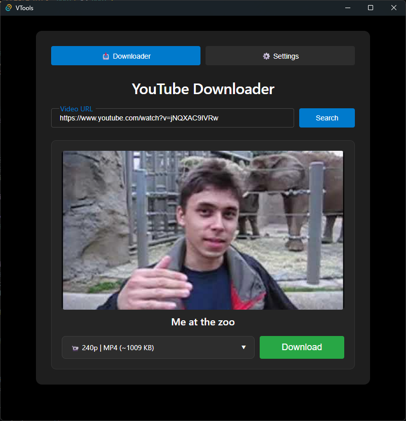

# VTools

A minimalist and efficient desktop video downloader powered by Tauri and yt-dlp.



## Features

- 📥 **YouTube Downloads**: Video and audio downloading powered by `yt-dlp`.
- ⚙️ **Settings & Preferences**: Manage output paths, auto-creation of directories, opening the folder after download, and embedding subtitles.
- 🎛️ **Format & Quality Control**: Choose your preferred formats and quality directly in the downloader interface.
- 🔄 **Auto-Update**: Built-in feature to check and update `yt-dlp` directly from the app.
- 🪟 **Clean Native UI**: Lightweight desktop experience built with Tauri and React.

> ⚠️ **Note:** The app bundles `ffmpeg` and `ffprobe` binaries, which is why the final build size is around ~300MB.

## Tech Stack

- **Frontend:** React, TypeScript, Vite, CSS
- **Backend:** Rust, Tauri v2
- **Core Binaries:** yt-dlp, ffmpeg, QuickJS (qjs)

## Binaries Setup

Because of file size limits, `ffmpeg` and `ffprobe` are not included in the repository. Before building the app, download them and place the `.exe` files into `src-tauri/bin/`:

- **ffmpeg & ffprobe**: Download [ffmpeg-master-latest-win64-gpl.zip](https://github.com/BtbN/FFmpeg-Builds/releases) from [BtbN/FFmpeg-Builds](https://github.com/BtbN/FFmpeg-Builds). Extract `ffmpeg.exe` and `ffprobe.exe` from the `bin/` folder inside the archive.
- **QuickJS (qjs)**: Already included in the repo (or get the latest from [QuickJS releases](https://github.com/quickjs-ng/quickjs/releases)).
- **yt-dlp**: Already included in the repo (or get the latest from [yt-dlp releases](https://github.com/yt-dlp/yt-dlp/releases)).

## Getting Started (Development)

1. Clone the repository:
   ```bash
   git clone https://github.com/AloneTheKnight/VTools.git
   cd VTools
   ```
2. Install dependencies:
   ```bash
   npm install
   ```
3. Run the development server:
   ```bash
   npm run tauri dev
   ```

## Building
To build the release `.exe`/installer:
   ```bash
   cargo tauri build
   ```